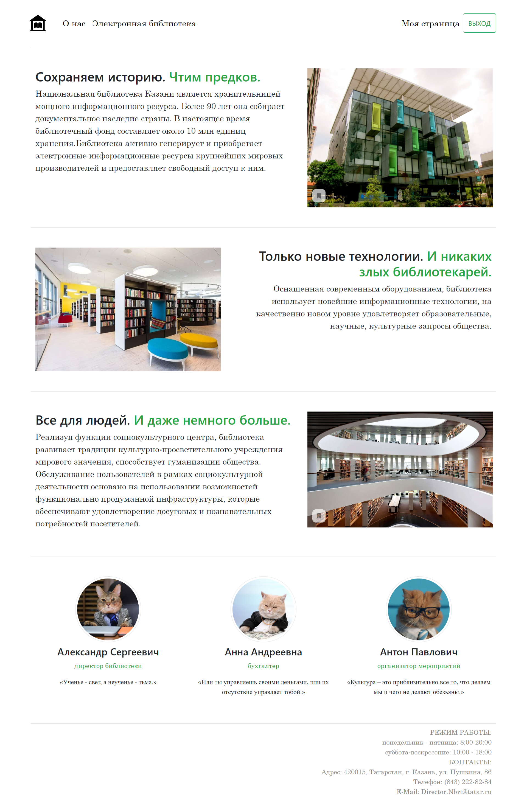
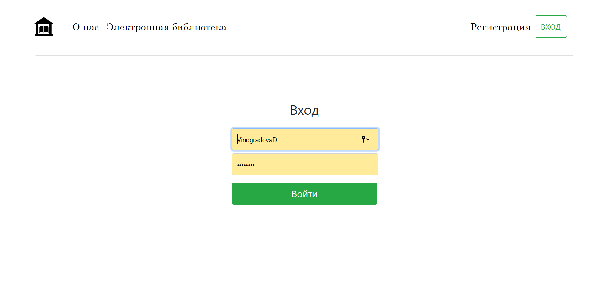
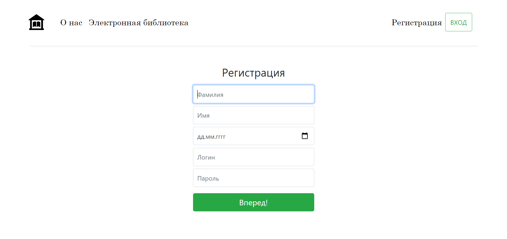
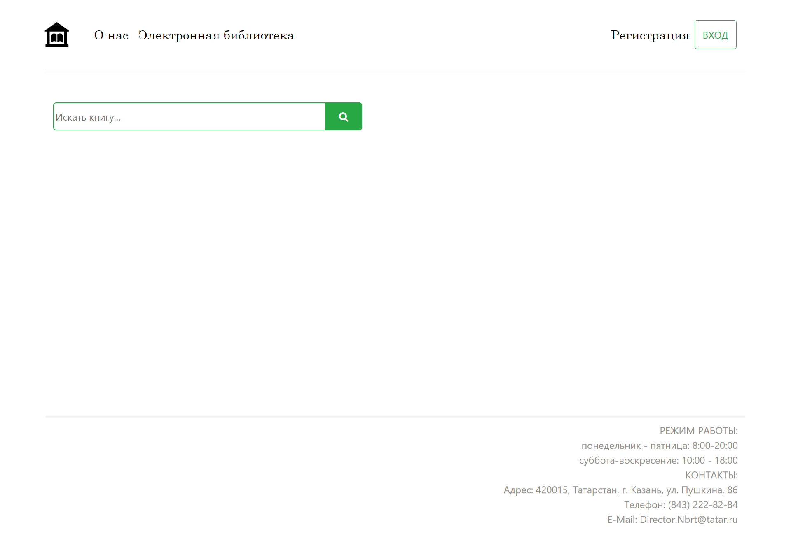

# Сайт для городской библиотеки.
Сайт в процессе разработки, знакомлюсь с такими технологиями как Spring Framework, Bootstrap, Thymeleaf, Hibernate.
Пока частично реализован интерфейс, планирутеся работа с базой данных для хранения книг и пользователей, создание ролей пользователей на сайте.

## Главная страница

## Вход

## Регистрация

## Каталог

