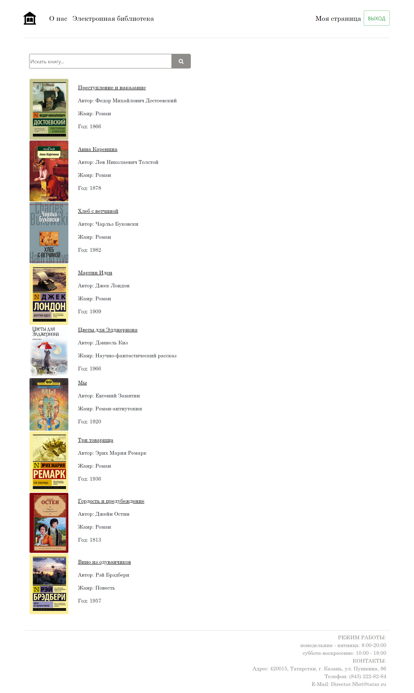

# Сайт для городской библиотеки.
Использованные технолгии: Java Spring Boot, Java Spring Security, Bootstrap, Theamleafe, JPA, Hibernate, SQL, CSS, HTML.

## Главная страница

## Вход

## Регистрация

## Каталог

## Подробнее о книге, отзывы

## Книжкая полка пользователя

